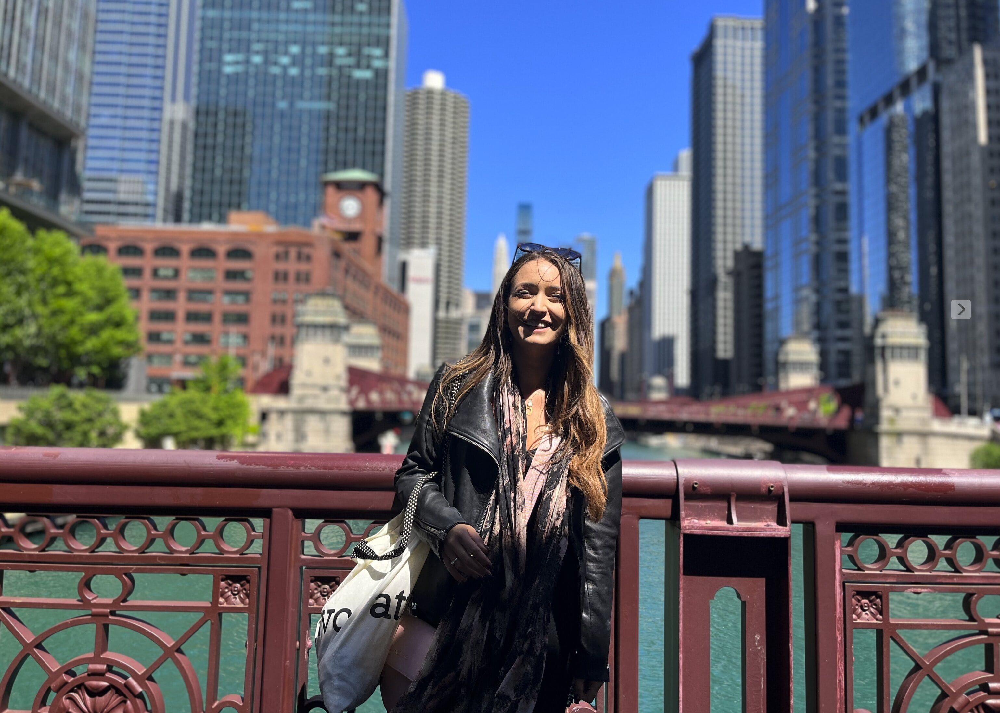

---
# Display name
title: Loukia Tzavella

# Full name (for SEO)
first_name: Loukia  
last_name: Tzavella

# Status emoji
status:
  icon: 

# Is this the primary user of the site?
superuser: true

# Role/position/tagline
role: Postdoctoral Research Associate

# Organizations/Affiliations to show in About widget
organizations:
  - name: CUBRIC, Cardiff University
    url: https://www.cardiff.ac.uk/cardiff-university-brain-research-imaging-centre

# Short bio (displayed in user profile at end of posts)
bio: 📚 My research interests include experimental psychology, cognitive neuroscience, implicit cognition, reproducibility and metascience.

# Social/Academic Networking
# For available icons, see: https://wowchemy.com/docs/getting-started/page-builder/#icons
#   For an email link, use "fas" icon pack, "envelope" icon, and a link in the
#   form "mailto:your-email@example.com" or "/#contact" for contact widget.
social:
  - icon: envelope
    icon_pack: fas
    link: 'mailto:tzavellal@gmail.com'
  - icon: google-scholar
    icon_pack: ai
    link: https://scholar.google.com/citations?user=1VGs9C0AAAAJ&hl=en
  - icon: orcid
    icon_pack: ai
    link: https://orcid.org/0000-0002-1463-9396 
  - icon: osf
    icon_pack: ai
    link: https://osf.io/pqb7s/ 
  - icon: researchgate
    icon_pack: ai
    link: https://www.researchgate.net/profile/Loukia_Tzavella 
  - icon: github
    icon_pack: fab
    link: https://github.com/LTzavella

  # Link to a PDF of your resume/CV.
  # To use: copy your resume to `static/uploads/resume.pdf`, enable `ai` icons in `params.yaml`,
  # and uncomment the lines below.
  - icon: cv
    icon_pack: ai
    link: uploads/resume.pdf

# Enter email to display Gravatar (if Gravatar enabled in Config)
email: ''

# Highlight the author in author lists? (true/false)
highlight_name: true
---
<meta name="viewport" content="width=device-width, initial-scale=1">

   
   
  <h2><b> Biography </b> </h2>
   
   
I currently work as a Postdoctoral Research Associate in Metascience at the School of Psychology, Cardiff University.
 

  
My doctoral work focused on response inhibition training for dietary behaviour change, including paradigm development, proof-of-concept experiments and online studies. Research studies further assess the validity of implicit cognition measures, such as the affective priming paradigm.

  
Current projects focus on the promotion, evaluation and implementation of open science practices and related initiatives, such as the Transparency and Promotion Openess (<a href="https://www.cos.io/initiatives/top-guidelines">TOP</a>) guidelines and Registered Reports (<a href="https://www.cos.io/initiatives/registered-reports">RRs</a>).   

  

<h2><b> Education </b> </h2>
  <ul>
  🔹 PhD Psychology - Cardiff University (2019)  
  🔹 MSc Neuroimaging Methods & Applications - Cardiff University (2014)  
  🔹 BSc Psychology - Nottingham Trent University (2013)
  </ul>
  
  

  
<h2><b> Interests </b> </h2>
<ul style="text-align: left">
📖 &nbsp Open science, reproducibility & metascience   
🍎 &nbsp Cognitive training for dietary behaviour change  
🖥️ &nbsp Implicit cognition & measurement validity  
🧠 &nbsp Cognitive neuroscience &  brain stimulation  
</ul>
  

